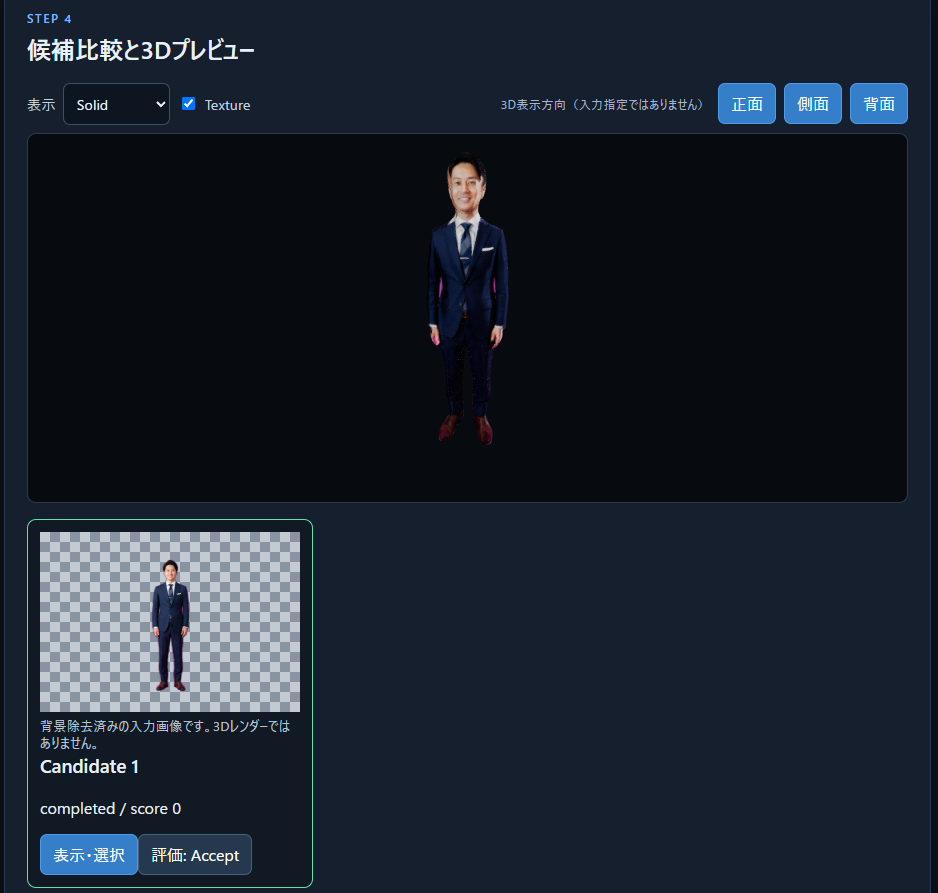

# Person Image-to-3D MVP

ローカル限定の人物特化 Image-to-3D ワークフローです。`docker compose up --build` で API/UI/mock生成/Blenderワーカーをまとめて起動します。UI は `http://localhost` にだけ公開されます。

開発時は既定の `BACKEND_MODE=mock` で、GPUなしでもアップロード→3候補→選択→ジョブの流れを確認できます。mock はブラウザとBlenderで読める有効なGLB（三角形）を生成するだけで、品質を偽装しません。Blenderの実行環境がある場合は optimize/export も動きます。

## 品質モード

画面で選べる「全身高品質（4方向）」は、前・後・人物本人基準の左・右をすべて必須入力にします。Hunyuan3D-2mv が4方向を形状推定に使い、続くCPU投影処理が4枚の元画像を全身テクスチャへ焼き込みます。標準は50ステップ、形状密度384、2048pxテクスチャで、1 Run あたり1候補を順番に生成します。4096pxテクスチャと形状密度256/384も選べます。処理時間とGPU/CPUメモリを多く使います。

「高速 SF3D（正面1枚）」は従来互換モードです。3候補を生成しますが、背面・左右は保存・比較用で、形状・テクスチャには使いません。既存Runもこのモードとして表示されます。

高品質モードも、画像間のポーズ・服・照明の不整合や、見えていない箇所を完全には解決できません。また、ゲームにそのまま投入できることは保証しません。メッシュ整理（retopology）、LOD、リグ、スキニングは別の後工程です。

実生成では `BACKEND_MODE=sf3d` とします。ワーカーイメージには公式 `Stability-AI/stable-fast-3d` と Hunyuan3D-2 のコード・依存関係がbuild時に導入されるため、ホストのソースcheckoutは不要です。利用許諾済みのHugging Face重みだけを事前に取得し、`HF_TOKEN` はDockerfile、compose、リポジトリへ保存しません。SF3DはPython APIでテクスチャ解像度512/1024/2048と、remeshなしを選択します。出力GLBを正規形式とします。

## Windows: モデルの事前取得とオフライン実行

SF3D/Hunyuan3D-2 の公式コードとHugging Faceのモデル重みは別物です。公式コードと依存関係はワーカーイメージにbuild時導入されます。SF3Dモデルはホスト側のプロジェクト配下 `./models/huggingface` にキャッシュし、Hunyuan3D-2mvモデルは `./models/hunyuan3d-2mv` に置きます。いずれも `.gitignore` 対象です。

1. Hugging Faceで [stabilityai/stable-fast-3d](https://huggingface.co/stabilityai/stable-fast-3d) のアクセスを申請・承認します（gated modelです）。
2. PowerShellで `hf auth login` を実行し、read権限トークンをホストのHugging Face認証情報へ保存します。トークンを `.env`、compose、リポジトリへ書かないでください。
3. `powershell -ExecutionPolicy Bypass -File .\scripts\download-model.ps1` を実行します。これは `stabilityai/stable-fast-3d` に加え、SF3Dが内部で使う `facebook/dinov2-large` と `laion/CLIP-ViT-B-32-laion2B-s34B-b79K` を `./models/huggingface/hub` へ、人物背景除去用の `u2net_human_seg.onnx` を `./models/rembg` へ取得します。
4. 高品質モードも使う場合は、Hugging Faceで [Tencent-Hunyuan/Hunyuan3D-2mv](https://huggingface.co/tencent/Hunyuan3D-2mv) の利用条件（Tencent Hunyuan Community License）に同意してから、`powershell -ExecutionPolicy Bypass -File .\scripts\download-hunyuan.ps1` を実行します。このスクリプトは非Turboの `model.fp16.safetensors` と設定、ライセンス情報だけを取得します。重み本体は約4.93GBです。
5. `.env` に `BACKEND_MODE=sf3d` を設定し、`docker compose -f docker-compose.yml -f docker-compose.sf3d.yml up --build` を実行します。追加composeファイルは `gpus: all` を有効にします。通常の `docker compose up --build` はGPU不要のmockモード用です。

composeは `HF_HOME=/models/huggingface`、`HUGGINGFACE_HUB_CACHE=/models/huggingface/hub`、`HF_HUB_OFFLINE=1` をsf3d-workerへ設定します。SF3DキャッシュはTransformersの初回キャッシュ移行が書込みを行うためread-writeです。一方、Hunyuan3D-2mvの専用モデルディレクトリはread-onlyでmountします。`HF_HUB_OFFLINE=1` はHugging Face Hubへの通信・ダウンロードを抑止する設定であり、コンテナ全体のあらゆる外部通信を遮断するものではありません。キャッシュまたは専用重みがない場合は、ジョブに診断エラーを記録します。

Hunyuan3D-2 のPython依存関係は `/opt/hunyuan-venv` に分離して導入します。これはSF3Dが使う固定版Transformers等と衝突させず、8GB VRAMでは形状生成時だけGPUへ段階的に移すためです。形状生成後はGPUメモリを解放し、元画像投影はCPUで行います。

高品質生成の出力フォルダには、最終 `mesh.glb` に加え、投影前の `mesh-shape.glb`、`texture.png`、`hunyuan.log`、`projection-diagnostics/` を保存します。診断フォルダの `coverage.json` にはテクスチャ被覆率と方向別のシルエットIoU、`coverage.png`・`source-map.png`・`silhouette-*.png` には投影の確認画像が入ります。前後左右の向き違い、切り抜き、または投影の失敗を確認する用途です。

## 人物の自動背景除去

入力は背景が均一でない人物画像をそのまま使えます。既定の「自動AI（人物）」は、実用的な透明度を持つPNGはその透明度を維持し、それ以外は `rembg` の `u2net_human_seg` で人物を切り抜きます。モデルは事前取得済みの `./models/rembg/u2net_human_seg.onnx` だけを使用し、実行中にネットワークから取得しません。単色背景画像には従来どおり「単色背景」を選んで背景色・許容差を指定できます。生成候補のプレビューはチェッカー背景で透過状態を確認できます。

`rembg` 本体はMITライセンスですが、モデル重みには別のライセンス・利用条件が適用される場合があります。配布・商用利用の前に、[rembgのモデル情報](https://github.com/danielgatis/rembg#models) と取得元の重みのライセンスを確認してください。

## 入力画像の方向

左右は、画面を見る人の左右ではなく**人物本人から見た左右**です。正面・背面・人物から見た左側面・人物から見た右側面は、同じ人物、できるだけ同じポーズ・画角・照明で用意してください。高品質モードでは4枚すべてが必須で、実際に形状とテクスチャへ使用されます。

SF3Dモードは Single Image-to-3D のため、3D生成に使われるのは正面画像だけです。3Dビューア内の「正面／側面／背面」は、出力済み3Dモデルを回転して見るための表示方向であり、入力画像の方向指定ではありません。

SQLiteはメタデータのみを保持し、大きなファイルは `./data` bind mount に保存します。コンテナ間に渡すのは相対パスだけで、APIはstorage外パスを拒否します。実モデルの導入、NVIDIA Docker GPU、Blenderコンテナのイメージ可用性はホスト依存です。

Blender workerは公式 Blender 4.2.0 Linux tarballをUbuntuベースのコンテナへ展開してheadless実行します。公式tarballに含まれるライセンスファイルは `/opt/blender` に保持されます。

テスト: `cd api; pip install -r requirements.txt; pytest -q`
